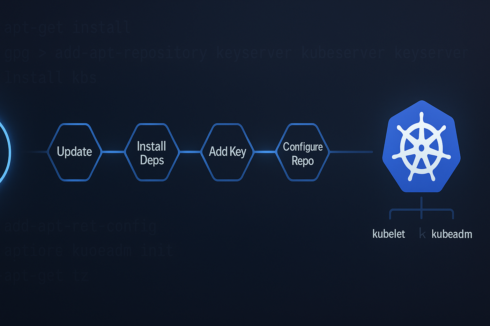

# Kubernetes Installer

Simple bash script to install Kubernetes components (kubelet, kubeadm, kubectl) on Debian/Ubuntu systems.

## Requirements

- Debian or Ubuntu-based Linux distribution
- Root or sudo access
- Internet connection

## Usage

```bash
chmod +x install-k8s.sh
./install-k8s.sh
```

## What It Does

1. Updates package index
2. Installs prerequisites (curl, gpg, apt-transport-https, ca-certificates)
3. Adds Kubernetes GPG signing key
4. Configures official Kubernetes APT repository
5. Installs kubelet, kubeadm, and kubectl
6. Locks package versions to prevent accidental upgrades

## Version

Installs from the **v1.34** stable release stream.

To change versions, edit the `K8S_VERSION_STREAM` variable in the script.

## After Installation

Verify installation:
```bash
kubeadm version
kubectl version --client
kubelet --version
```

Next steps: Initialize a cluster with `kubeadm init` or join an existing cluster with `kubeadm join`.
